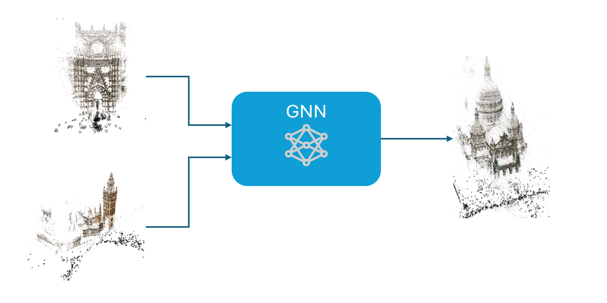
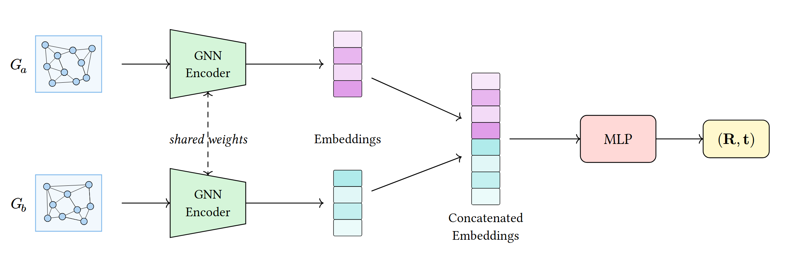

# About

This project explores how we might be able to use graph neural networks to stitch together disparate structure from motion (SfM) reconstructions.
The project was completed as part of George Mason University's CS 782 - Advanced Machine Learning course in Fall 2025.
(This code is still a work in progress.)





The ideas in this project are original and were generated by Jack Daus. Details on the problem development and related literature
are documented in the accompanying paper, `report.pdf.` I, Jack Daus, take full responsibility for the originality and accuracy of the content. 
I used GitHub Copilot (Claude, Gemini, and/or ChatGPT) as a coding assistant for implementation and debugging. 

## Generating Data

To generate the data from colmap reconstructions, use the `generate_data.py` script. Prior to running this script, 
you will need to have a colmap reconstruction available locally. See that script for more details.

To generate the 3 datasets used in the experiments.
```bash
# Dataset with only translations perturbations applied
uv run generate_data.py --config-name v1_trans_only

# Dataset with only rotations perturbations applied
uv run generate_data.py --config-name v2_rot_only

# Dataset with both rotations and translations perturbations applied
uv run generate_data.py --config-name v3_rot_and_trans
```

## Run Experiments

To run the experiments, use the `train.py` script with the appropriate configuration files located in the `conf` directory.

```bash
# Experiments set 1: Translation only perturbations
uv run train.py --config-path conf/e1 --config-name e1_0_base
uv run train.py --config-path conf/e1 --config-name e1_1_gat
uv run train.py --config-path conf/e1 --config-name e1_2_gat_emb256

# Experiments set 2: Rotation only perturbations
uv run train.py --config-path conf/e2 --config-name e2_0_base
uv run train.py --config-path conf/e2 --config-name e2_0_a_base
uv run train.py --config-path conf/e2 --config-name e2_0_b_base
uv run train.py --config-path conf/e2 --config-name e2_1_no_frob_reg
uv run train.py --config-path conf/e2 --config-name e2_1_a_no_frob_reg
uv run train.py --config-path conf/e2 --config-name e2_2_quaternion
uv run train.py --config-path conf/e2 --config-name e2_2_a_quaternion
uv run train.py --config-path conf/e2 --config-name e2_3_quaternion_naive
uv run train.py --config-path conf/e2 --config-name e2_3_a_quaternion_naive

# Experiments set 3: Rotation and Translation perturbations
uv run train.py --config-path conf/e3 --config-name e3_0-NEW
uv run train.py --config-path conf/e3 --config-name e3_1-NEW

# Experiments set 4: With image features
uv run train.py --config-path conf/e4 --config-name e4_0_base
uv run train.py --config-path conf/e4 --config-name e4_1_quat_mse
```

The `train.py` script will save model checkpoints and TensorBoard logs to the `runs/` directory by default. View the logs with:
```bash
tensorboard --logdir=runs
```

## Data Generation Details

Configuration is in `conf/data_gen/base.yaml`. Key parameters:
- `paths.model` - COLMAP reconstruction directory
- `paths.images` - Source images directory  
- `paths.output` - Output directory (default: `data/generated`)
- `generation.num_samples` - Number of training samples
- `generation.subset_size` - Images per graph
- `features.img_size` - Image resize dimension

Output files:
- `image_features.pt` - Shared image feature cache
- `samples.pt` - Training samples